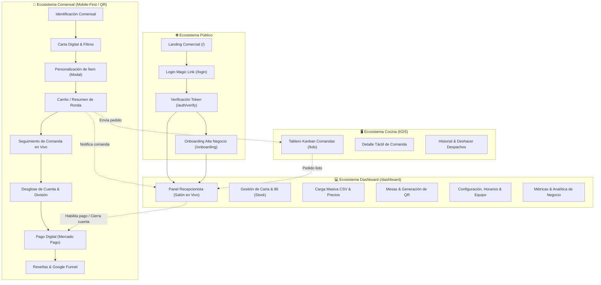

# Mapa Funcional de Pantallas y Flujos de Usuario — Mesa CLICK

> **Propósito del documento**: Servir como especificación funcional y mapa de navegación para concebir y desarrollar un nuevo diseño web/móvil para la plataforma **Mesa CLICK**.  
> **Enfoque**: Se define la **estructura de información, contexto de uso, datos y flujos de interacción** de cada pantalla, sin atarse a implementaciones visuales particulares (colores, tipografías o librerías CSS).

---

## 1. Matriz de Dispositivos y Contexto de Uso

| Ecosistema | Actor Principal | Dispositivo Objetivo | Prioridad de Diseño | Contexto de Uso Típico |
|---|---|---|---|---|
| **Comensal (QR)** | Cliente final / Grupo | 📱 **Smartphone (Mobile)** | **Mobile-First Estricto** | Sentado en mesa, conexión 4G/WiFi del local, uso vertical con una sola mano, interacción rápida sin instalación de app. |
| **Cocina (KDS)** | Cocinero / Jefe de cocina | 🖥️ **Tablet / Monitor Táctil** | **Touch Horizontal (Landscape)** | Ambiente caluroso, distancia de visión de 0.5m a 1.5m, dedos húmedos/enguantados, velocidad operativa extrema. |
| **Salón / Recepción** | Mozo / Encargado / Host | 💻 **Tablet / Laptop / Desktop** | **Responsive Híbrido** | Mostrador de entrada o tablet de mozo en salón; supervisión constante de alertas y cierre de cuentas. |
| **Administración** | Dueño de negocio / Admin | 💻 **Desktop / Laptop** | **Desktop-First** | Oficina o PC del local; tareas de alta densidad de datos (carga de cartas, importación CSV, configuración fiscal y horarios). |
| **Acceso & Público** | Visitantes / Dueños nuevos | 🌐 **Universal (Mobile & Desktop)** | **Responsive Fluido** | Landing comercial, inicio de sesión por enlace mágico y verificación de acceso. |

---

## 2. Mapa General de Navegación del Sistema

---

## 3. Ecosistema Comensal / Cliente en Mesa (`/mesa/[token]`)
> ⚠️ **REGLA MANDATORIA**: Este ecosistema es **100% Mobile-First**. Todas las pantallas y transiciones deben diseñarse pensando exclusivamente en la ergonomía táctil de un smartphone (pantallas de 360px a 430px de ancho), navegación con el pulgar, áreas de toque amplias (mínimo 44px) y ausencia de fricción o inicios de sesión obligatorios.

---

### Pantalla C01: Identificación y Registro Colaborativo en Mesa
* **Ruta**: `/mesa/[token]` (primer escaneo o usuario nuevo en la mesa).
* **Actor**: Comensal (individual o participante de mesa grupal).
* **Dispositivo**: 📱 Mobile (Smartphone vertical).
* **Propósito**: Conectar al cliente con la mesa física escaneada y personalizar su pedido colaborativo sin requerir usuario ni contraseña.
* **Bloques Funcionales**:
  1. **Encabezado de Bienvenida**: Identificación del local comercial (logo, nombre) y número de mesa asignada (ej: "Mesa 14 - Terraza").
  2. **Campo de Identificación Ligera**: Input de texto libre para nombre o alias ("¿Cómo te llamás? Ej: Pablo").
  3. **Lista de Participantes Activos en la Mesa**: Visualización de los comensales ya conectados a la mesa en esa misma sesión (ej: "Martín y Sofía ya están pidiendo").
  4. **Acción Principal**: Botón destacado "Comenzar a pedir" o "Unirme a la mesa".
  5. **Acción Secundaria**: Opción de omitir o continuar como "Comensal anónimo".
* **Flujos y Acciones**:
  * **Ingreso de nombre**: El usuario escribe su nombre y confirma.
  * **Persistencia local**: El sistema guarda el ID del comensal en almacenamiento local (`localStorage`) para asociar todos sus platos y calcular su desglose individual.
  * **Transición**: Redirige de inmediato a **C02 (Carta Digital)**.
  * **Validación de mesa inactiva**: Si la mesa está cerrada por el local, redirige a la pantalla de espera de mesa.

---

### Pantalla C02: Carta Digital Interactiva y Explorador de Menú
* **Ruta**: `/mesa/[token]` (vista principal del cliente).
* **Actor**: Comensal.
* **Dispositivo**: 📱 Mobile (Smartphone vertical).
* **Propósito**: Permitir al comensal navegar el menú de forma ágil, ver precios actualizados, fotos de platos, estado de disponibilidad en tiempo real y filtrar por tipo de comida.
* **Bloques Funcionales**:
  1. **Barra Superior Fija (Sticky Header)**:
     * Nombre del local y número de mesa.
     * Indicador de comensal activo (con opción de editar alias).
     * Indicador de estado de la cuenta (activa, cuenta solicitada).
  2. **Buscador y Selector de Categorías (Sticky horizontal)**:
     * Carrusel deslizante de categorías (ej: Entradas, Hamburguesas, Bebidas, Postres).
     * Selector que se fija en el tope al hacer scroll y resalta la categoría visible.
     * Filtros rápidos dietarios (Vegetariano, Vegano, Celíaco/Sin TACC).
  3. **Banner de Franja Horaria (Contextual)**:
     * Aviso si la carta actual corresponde a un turno específico (ej: "Menú Almuerzo disponible hasta las 16:00").
  4. **Listado de Artículos por Categoría**:
     * Tarjeta de producto con:
       * Foto de alta resolución (optimizada para carga rápida).
       * Nombre del plato y descripción resumida de ingredientes.
       * Precio unitario visible.
       * Etiquetas dietarias (íconos de alérgenos).
       * Indicador de disponibilidad: Ítem habilitado vs. Ítem "Agotado / Sin stock temporal (86)".
       * Botón de adición directa (+) o botón de personalización si tiene variantes.
  5. **Barra Flotante Inferior de Pedido (Sticky Bottom Bar)**:
     * Contador de ítems en el carrito de la ronda actual.
     * Monto subtotal acumulado.
     * Botón para abrir el carrito / resumen ("Ver pedido").
* **Flujos y Acciones**:
  * **Scroll de categorías**: El usuario desliza la pantalla; el selector superior resalta la categoría en foco.
  * **Tap en ítem sin variantes**: Suma una unidad al carrito y activa un feedback háptico/visual.
  * **Tap en ítem con opciones/variantes**: Abre la pantalla **C03 (Modal de Personalización)**.
  * **Ítem marcado como agotado (86)**: La tarjeta se deshabilita visualmente; el botón de compra se bloquea indicando "Agotado por hoy".
  * **Tap en barra inferior**: Despliega **C04 (Carrito / Resumen de Ronda)**.
  * **Tap en botón de cuenta**: Navega a **C06 (Desglose de Cuenta)**.

---

### Pantalla C03: Personalización de Producto (Modal / Bottom Sheet)
* **Ruta**: Overlay contextual sobre `/mesa/[token]`.
* **Actor**: Comensal.
* **Dispositivo**: 📱 Mobile (Bottom-sheet interactivo con gestos de arrastre).
* **Propósito**: Configurar preferencias específicas de un plato (término de cocción, guarniciones, extras y notas de cocina) antes de incluirlo en el pedido.
* **Bloques Funcionales**:
  1. **Cabecera de Producto**: Foto ampliada, nombre, descripción detallada y precio base.
  2. **Grupos de Opciones Obligatorias**:
     * Selección única (Radio button), ej: "Punto de la carne: Jugoso / A punto / Cocido".
  3. **Grupos de Opciones Opcionales / Extras**:
     * Selección múltiple (Checkbox) con recargo de precio, ej: "+ Panceta crocante (+$800)", "+ Doble queso (+$600)".
  4. **Notas para la Cocina**:
     * Campo de texto libre para aclaraciones especiales (ej: "Sin cebolla por favor", "Aderezo aparte").
  5. **Selector de Cantidad**: Controles táctiles `-` y `+` con la cantidad deseada.
  6. **Botón de Acción Inferior Fijo**: "Agregar al pedido — $Total Calculado".
* **Flujos y Acciones**:
  * **Selección de variantes**: El precio final se recalcula automáticamente en tiempo real.
  * **Validación de obligatoriedad**: El botón de confirmación permanece inactivo hasta que se seleccionen las opciones requeridas.
  * **Confirmar**: Agrega el ítem parametrizado al carrito, cierra el panel con animación hacia abajo y actualiza la barra inferior.
  * **Cancelar/Cerrar**: Deslizar hacia abajo o presionar la cruz descarta los cambios.

---

### Pantalla C04: Carrito Colaborativo y Confirmación de Ronda
* **Ruta**: Panel inferior deslizable o vista modal en `/mesa/[token]`.
* **Actor**: Comensales en la mesa.
* **Dispositivo**: 📱 Mobile.
* **Propósito**: Revisar los platos seleccionados por uno o más comensales antes de enviarlos a producción en cocina.
* **Bloques Funcionales**:
  1. **Cabecera**: "Tu pedido para la Mesa X" y botón de cerrar/minimizar.
  2. **Agrupación de Ítems por Comensal**:
     * Bloque "Tus elecciones (Pablo)": lista de ítems agregados por el dispositivo actual con controles de edición de cantidad y eliminación.
     * Bloque "Agregado por otros comensales" (en caso colaborativo): muestra los platos seleccionados por los acompañantes en tiempo real.
  3. **Detalle por Ítem**: Cantidad, nombre, opciones elegidas, nota personalizada y subtotal.
  4. **Resumen de Costos de la Ronda**: Subtotal acumulado de los platos a confirmar en esta tanda.
  5. **Acción Principal**: Botón prominente "Confirmar y enviar a cocina".
  6. **Acción Secundaria**: "Seguir agregando platos" (minimiza el carrito).
* **Flujos y Acciones**:
  * **Modificar cantidades**: El usuario suma/resta o elimina un ítem; el total se actualiza de inmediato.
  * **Confirmación de Comanda**:
    * El usuario presiona "Enviar a cocina".
    * El sistema realiza la llamada atómica al backend.
    * Al recibir confirmación, vacía el carrito local y transiciona a **C05 (Seguimiento de Comanda)**.
    * Se dispara el evento en tiempo real hacia la pantalla de cocina (**KDS**) y hacia el panel de recepción.

---

### Pantalla C05: Seguimiento del Pedido en Tiempo Real
* **Ruta**: Vista de estado en `/mesa/[token]`.
* **Actor**: Comensal.
* **Dispositivo**: 📱 Mobile.
* **Propósito**: Brindar visibilidad y certidumbre al cliente sobre el avance de su comida en cocina sin necesidad de llamar al mozo.
* **Bloques Funcionales**:
  1. **Identificador de Comanda**: Número de comanda y hora de envío.
  2. **Línea de Tiempo de Estados (Stepper Visual)**:
     * `Recibido`: La orden ingresó al sistema.
     * `En Preparación`: Cocina inició la elaboración.
     * `Listo`: Los platos salieron de cocina y están en camino a la mesa.
     * `Entregado`: El mozo depositó los platos en la mesa.
  3. **Listado de Ítems de la Comanda**: Con su estado individual (si un plato ya está listo y otro sigue en preparación).
  4. **Historial de Comandas Anteriores**: Si la mesa ya realizó pedidos previos en la misma sesión, se muestran como tandas entregadas.
  5. **Acciones Rápidas**:
     * Botón "Pedir algo más" (vuelve a **C02 Carta Digital** para una nueva ronda).
     * Botón "Ver cuenta acumulada" (navega a **C06**).
* **Flujos y Acciones**:
  * **Actualización en vivo (SSE)**: Cuando cocina cambia el estado de un ítem o de la orden, la barra de progreso avanza automáticamente sin parpadeos ni recargas de página.
  * **Alerta de pedido listo**: Notificación visual sutil en el celular cuando el pedido pasa a "Listo para retirar".

---

### Pantalla C06: Desglose de Cuenta y División por Comensal
* **Ruta**: `/mesa/[token]/cuenta` o pestaña dedicada dentro del flujo QR.
* **Actor**: Comensal(es).
* **Dispositivo**: 📱 Mobile.
* **Propósito**: Transparentar el consumo total de la mesa y resolver la división de gastos individual o compartida con exactitud.
* **Bloques Funcionales**:
  1. **Resumen Global de la Mesa**:
     * Número de mesa y tiempo de permanencia.
     * Total general a pagar (suma de todas las rondas de pedidos confirmados).
  2. **Selector de Modalidad de Cuenta**:
     * Pestaña "Ver cuenta total": Listado completo de productos ordenados por tanda.
     * Pestaña "Dividir por persona": Desglose individualizado según quién ordenó cada plato.
  3. **Detalle por Persona (Cálculo Colaborativo)**:
     * Tarjeta individual para cada comensal con sus platos consumidos y su subtotal exacto.
     * Bloque de "Ítems compartidos" (ej: una botella de vino o una porción de papas dividida entre todos).
  4. **Botonera de Solicitud de Cierre**:
     * Botón "Pedir la cuenta al mozo" (efectivo / tarjeta en mesa).
     * Botón "Pagar desde el celular" (si el pago digital está habilitado).
* **Flujos y Acciones**:
  * **Alternancia de vista**: El usuario revisa su parte o el total de la mesa para acordar con sus acompañantes.
  * **Presionar "Pedir la cuenta"**:
    * Envía solicitud inmediata al salón.
    * Bloquea la adición de nuevos pedidos en la mesa.
    * La interfaz pasa al estado "Cuenta solicitada — Un mozo se está acercando".
    * Si el mozo habilita pago digital, se desbloquea **C07 (Mercado Pago)**.

---

### Pantalla C07: Pago Digital Autónomo (Mercado Pago)
* **Ruta**: Subflujo en `/mesa/[token]`.
* **Actor**: Comensal.
* **Dispositivo**: 📱 Mobile.
* **Propósito**: Permitir al comensal abonar su cuenta o su parte directamente desde su smartphone sin esperar la terminal física del mozo.
* **Bloques Funcionales**:
  1. **Monto a Pagar**: Total general o monto correspondiente al comensal.
  2. **Medio de Pago**: Integración oficial con Mercado Pago Checkout Pro (Dinero en cuenta, Débito, Crédito).
  3. **Botón Principal**: "Pagar con Mercado Pago".
  4. **Estado de Transacción**:
     * Procesando pago...
     * Pago Aprobado (con número de comprobante oficial).
     * Pago Rechazado / Reintentar.
* **Flujos y Acciones**:
  * El comensal toca "Pagar", se abre la pasarela de Mercado Pago (app o webview segura).
  * Tras abonar, el webhook notifica al backend de Mesa CLICK.
  * El panel de recepción recibe la alerta de pago completado en tiempo real.
  * La pantalla transiciona automáticamente a **C08 (Agradecimiento y Reseñas)**.

---

### Pantalla C08: Pantalla Final de Cierre, Agradecimiento y Smart Google Funnel
* **Ruta**: Estado final en `/mesa/[token]`.
* **Actor**: Comensal.
* **Dispositivo**: 📱 Mobile.
* **Propósito**: Cerrar el ciclo de experiencia del cliente, confirmar el cierre de la cuenta y capturar reputación online de forma estratégica.
* **Bloques Funcionales**:
  1. **Comprobante de Cuenta Cerrada**: Saludo de despedida y confirmación de mesa liberada.
  2. **Módulo de Calificación por Estrellas (1 a 5 estrellas)**.
  3. **Smart Google Funnel (Derivación Inteligente de Opiniones)**:
     * **Si califica 4 o 5 estrellas**: Aparece un botón de llamada a la acción destacado: "¡Nos alegra que hayas disfrutado! Compartí tu experiencia en Google Maps" (abre directamente la ficha de Google Reviews del local).
     * **Si califica 1, 2 o 3 estrellas**: Se despliega un formulario de feedback privado interno ("Contanos qué podemos mejorar") para retener la queja internamente sin dañar la reputación pública y alertar al encargado.
* **Flujos y Acciones**:
  * El cliente califica; según el puntaje se bifurca la acción.
  * Al finalizar, se deshabilita la sesión de mesa para ese dispositivo.

---

### Pantalla C09: Estados de Excepción de Mesa
* **Ruta**: `/mesa/[token]`.
* **Dispositivo**: 📱 Mobile.
* **Casos contemplados**:
  1. **Mesa Inactiva / No Abierta**: Mensaje explicativo informando que la mesa aún no fue habilitada por el personal del restaurante.
  2. **Código QR Inválido o Expirado**: Mensaje de error guiando al cliente a solicitar asistencia al personal.
  3. **Sin Conexión a Internet**: Banner persistente de alerta avisando que se perdió la conexión y reintentando automáticamente en segundo plano.

---

## 4. Ecosistema de Producción y Cocina (`/kds`)
> ⚠️ **REGLA DE FORMATO**: Este módulo está diseñado para **Tablets o Monitores Táctiles en orientación horizontal (Landscape)** montados en paredes, barras o mostradores de despacho de cocina.

---

### Pantalla K01: Tablero Kanban Operativo de Cocina (KDS)
* **Ruta**: `/kds`.
* **Actor**: Cocinero, Chef de partida, Encargado de expedición / pase.
* **Dispositivo**: 🖥️ Tablet / Monitor táctil (Dark Mode de alto contraste).
* **Propósito**: Visualizar, priorizar y despachar los pedidos que ingresan desde las mesas en tiempo real con alertas auditivas y temporizadores visuales de antigüedad.
* **Bloques Funcionales**:
  1. **Barra Superior Operativa (KDS Header)**:
     * Identificación de estación / cocina.
     * Selector de sucursal (para locales con múltiples áreas o locales).
     * Reloj digital en vivo en formato grande (`HH:MM:SS`).
     * Baliza de estado de conexión en tiempo real (En vivo SSE vs. Reconectando).
     * Botón de acceso al historial de comandas despachadas (con contador de despachos).
     * Toggle táctil para activar/silenciar sonido de campana.
     * Botón de Pantalla Completa (Fullscreen) para bloquear la interfaz en terminales táctiles.
  2. **Columna 1: Comandas Pendientes**:
     * Contenedor con encabezado distintivo y contador de órdenes en espera.
     * Listado ordenado bajo criterio FIFO (First In, First Out: la orden más antigua siempre arriba a la izquierda).
  3. **Columna 2: Comandas En Preparación**:
     * Contenedor de pedidos que ya tienen al menos un ítem siendo cocinado.
  4. **Columna 3: Comandas Listas para Retirar**:
     * Contenedor de comandas completadas que aguardan que el mozo las retire para llevar a la mesa.
  5. **Tarjeta de Comanda Táctil (ComandaCard)**:
     * Encabezado de comanda: Número de mesa destacado en fuente grande, sector y código alfanumérico corto (`#12A4`).
     * Temporizador cromático de antigüedad en minutos y segundos:
       * 🟢 **Verde**: Menos de 10 minutos desde el pedido.
       * 🟡 **Amarillo**: Entre 10 y 20 minutos de espera.
       * 🔴 **Rojo parpadeante**: Más de 20 minutos de demora (prioridad crítica).
     * Lista de ítems de la orden:
       * Cantidad en tipografía grande (`2×`).
       * Nombre del producto.
       * Desglose de variantes y adicionales elegidos.
       * Recuadro de alerta destacado para **Notas del Comensal** (ej: "⚠️ Alérgico al maní", "Bien cocido").
       * Nombre del comensal que solicitó el plato.
       * Casilla táctil de estado individual por ítem (Pendiente / Preparando / Listo).
     * Botonera inferior rápida:
       * Botón "Comanda Completa Lista": marca todos los platos listos en un solo toque.
       * Botón "Despachar / Retirar": finaliza la orden en cocina y la envía al salón.
* **Flujos y Acciones**:
  * **Ingreso de nuevo pedido**: Suena un chime sonoro automático (Web Audio API), la tarjeta aparece en "Pendientes" y comienza a correr su cronómetro.
  * **Tap sobre un ítem**: El cocinero toca un producto específico; el ítem rota de estado (`pendiente` ➔ `preparando` ➔ `listo` con tachado visual).
  * **Tap en "Comanda Completa Lista"**: Todos los ítems pasan a listo, suena acorde armónico de confirmación y la tarjeta se traslada a la columna "Listos para Retirar".
  * **Tap en "Despachar"**: La comanda sale del tablero activo y se registra en el historial de despachos.
  * **Sincronización en tiempo real**: Todo cambio de estado impacta simultáneamente en el panel del mozo y en el teléfono del comensal.

---

### Pantalla K02: Historial de Despachos y Deshacer (Drawer Lateral)
* **Ruta**: Panel lateral deslizable en `/kds`.
* **Actor**: Cocina.
* **Dispositivo**: 🖥️ Tablet / Monitor táctil.
* **Propósito**: Permitir recuperar comandas despachadas por error o consultar los pedidos servidos en los últimos minutos.
* **Bloques Funcionales**:
  1. Encabezado con botón de cierre rápido.
  2. Listado de las últimas 30 comandas despachadas con hora exacta de salida.
  3. Botón por comanda: **"↩️ Reabrir / Devolver a Cocina"**.
* **Flujos y Acciones**:
  * Si el cocinero presionó "Despachar" por equivocación, abre el panel y toca "Reabrir".
  * La orden vuelve inmediatamente al tablero Kanban en el estado exacto en que se encontraba.

---

## 5. Ecosistema de Administración y Salón (`/dashboard`)
> ⚠️ **REGLA DE FORMATO**: Este ecosistema está diseñado bajo el paradigma **Desktop & Tablet First**. Está pensado para computadoras de escritorio, portátiles y tablets en mostrador con alta densidad de información, menús de gestión, tablas y formularios extensos.

---

### Pantalla D01: Shell General y Navegación del Dashboard
* **Ruta**: `/dashboard`.
* **Actor**: Administrador, Encargado de local.
* **Dispositivo**: 💻 Desktop / Tablet.
* **Bloques Funcionales**:
  1. **Barra Lateral de Navegación (Sidebar)**:
     * Marca del local y logo.
     * Enlace a módulo **Carta**.
     * Enlace a módulo **Mesas & QR**.
     * Enlace a módulo **Recepcionista (Salón en Vivo)**.
     * **Acceso Directo a Cocina (KDS)**: Ubicado inmediatamente debajo de Recepcionista para abrir la vista de cocina en nueva pestaña o ventana táctil.
     * Enlace a módulo **Configuración**.
     * Acceso al **Recorrido Tutorial (Tour guiado)**.
  2. **Barra Superior de Control**:
     * Nombre y slug del comercio activo.
     * Indicador de sucursal seleccionada.
     * Menú de usuario (perfil, logout).

---

### Pantalla D02: Panel Recepcionista (Salón en Tiempo Real)
* **Ruta**: `/dashboard` (Sección Recepcionista).
* **Actor**: Mozo, Recepcionista, Encargado de turno.
* **Dispositivo**: 💻 Desktop / Tablet (pantalla de salón o tablet de mozo).
* **Propósito**: Gestionar las mesas del salón, recibir alertas visuales y sonoras de platos listos en cocina, atender solicitudes de cuenta y cobrar.
* **Bloques Funcionales**:
  1. **Encabezado con Alertas Globales**:
     * Contador de mesas activas y pedidos en curso.
     * **Baliza luminosa pulsante de platos listos**: Luz verde parpadeante visible a distancia indicando: `🟢 🛎️ ¡X pedidos listos para retirar de cocina!`.
     * Botón de acceso directo a KDS.
     * Indicador de estado de conexión SSE (En vivo).
  2. **Bloque Prioritario 1: Solicitudes de Cuenta**:
     * Tarjetas de mesas que tocaron "Pedir la cuenta" en su celular (resaltadas en tono de alerta).
     * Opciones: "Habilitar pago con Mercado Pago", "Cerrar cuenta en efectivo/POS".
  3. **Bloque Prioritario 2: Listos para Retirar de Cocina (Luz de Alerta de Salón)**:
     * Tarjetas de mesas cuya comida fue completada en cocina.
     * Borde verde brillante, banner parpadeante `¡PEDIDO LISTO EN COCINA! - Llevar a mesa`.
     * Botón directo: `🛎️ Ver / Entregar pedido`.
  4. **Bloque 3: Mesas con Pedidos en Preparación / Curso**:
     * Grilla de todas las demás mesas ocupadas consumiendo o esperando preparación.
  5. **Modal de Detalle y Operación de Mesa**:
     * Desglose completo de pedidos de la mesa agrupados por comensal.
     * Botón "Marcar pedido como entregado a la mesa" (apaga la alerta de cocina).
     * Botón "Habilitar Mercado Pago" (desbloquea el cobro digital en el celular del cliente).
     * Botón "Cerrar cuenta" (libera la mesa y la reinicia para nuevos comensales).
* **Flujos y Acciones**:
  * **Alerta de Cocina**: Cuando el KDS marca una orden lista, el recepcionista escucha una señal sonora y ve encenderse la baliza verde en el encabezado y en la tarjeta de la mesa correspondiente.
  * **Entrega**: El mozo retira los platos, los sirve en la mesa y toca "Marcar como entregado".
  * **Cobro**: El mozo habilita Mercado Pago o cobra por caja física y presiona "Cerrar cuenta" con confirmación de seguridad.

---

### Pantalla D03: Gestión de Carta, Categorías y Stock en Vivo (86)
* **Ruta**: `/dashboard` (Sección Carta).
* **Actor**: Administrador, Encargado de cocina / salón.
* **Dispositivo**: 💻 Desktop / Tablet.
* **Propósito**: Administrar el menú completo del restaurante, precios, descripciones, variantes y apagar productos temporalmente sin stock (86) en un clic.
* **Bloques Funcionales**:
  1. **Botonera Superior de Acciones de Catálogo**:
     * Botón "Nuevo Artículo".
     * Botón "Nueva Categoría".
     * Botón "Carga Masiva (CSV / Excel)".
     * Botón "Ajuste Masivo de Precios (%)".
  2. **Gestor de Categorías**:
     * Lista de categorías con reordenamiento por arrastre (Drag & drop).
     * Asignación de franjas horarias a categorías (ej: "Cafetería: 08:00 a 12:00").
  3. **Tabla / Grilla de Artículos**:
     * Miniatura de foto.
     * Nombre, categoría y precio actual.
     * **Switch de Disponibilidad Rápida (86 / Sin Stock)**: Interruptor táctil de un solo clic que marca el plato como agotado en toda la plataforma en tiempo real.
     * Acciones: Editar, gestionar variantes/adicionales, eliminar.
  4. **Formulario de Creación / Edición de Artículo (Modal)**:
     * Campos: Nombre, categoría, descripción, precio, subida de foto.
     * Constructor de Grupos de Variantes (ej: Tamaño, Salsas, Guarnición) con precios adicionales.
* **Flujos y Acciones**:
  * **Corte de stock imprevisto en cocina**: El encargado hace clic en el interruptor del producto; instantáneamente, todos los comensales que tengan la carta abierta en sus teléfonos verán el ítem bloqueado como "Agotado".

---

### Pantalla D04: Carga Masiva (CSV/Excel) y Ajuste Porcentual de Precios
* **Ruta**: Modales interactivos dentro de Carta en `/dashboard`.
* **Actor**: Administrador.
* **Dispositivo**: 💻 Desktop (alta interacción con archivos y planillas).
* **Propósito**: Importar catálogos completos en segundos y actualizar precios por inflación o cambio de temporada.
* **Bloques Funcionales**:
  1. **Modal de Carga Masiva**:
     * Enlace de descarga de la plantilla oficial (.CSV / .XLSX).
     * Zona de arrastre de archivos (Drag & Drop zone).
     * Tabla de previsualización con detección de errores fila por fila antes de aplicar cambios.
     * Botón "Procesar importación atómica".
  2. **Modal de Ajuste Porcentual de Precios**:
     * Selector de alcance: "Toda la carta" o "Categoría específica".
     * Campo de porcentaje: aumento (+) o descuento (-).
     * Regla de redondeo (ej: redondear a centenas o decenas).
     * Previsualización del impacto antes de confirmar.
* **Flujos y Acciones**:
  * El usuario sube una planilla con 200 platos; el sistema valida los formatos, muestra errores si faltan columnas y los inserta en una sola transacción sin inconsistencias.

---

### Pantalla D05: Gestión de Mesas, Sectores y Códigos QR
* **Ruta**: `/dashboard` (Sección Mesas & QR).
* **Actor**: Administrador, Encargado.
* **Dispositivo**: 💻 Desktop / Tablet.
* **Propósito**: Mapear la distribución física del salón y generar el material impreso para las mesas.
* **Bloques Funcionales**:
  1. **Selector de Sucursal y Sectores**:
     * Pestañas por sector (Interior, Patio, Terraza, Barra).
     * Botón para crear nuevo sector.
  2. **Grilla de Mesas**:
     * Tarjeta por mesa indicando número, capacidad de personas, estado (activa/inactiva) y token único.
     * Botón para agregar mesa individual o generar lote de mesas consecutivas (ej: de mesa 1 a 20).
  3. **Generador y Exportador de Códigos QR**:
     * Vista previa del código QR con diseño de marca.
     * Botón "Descargar QR individual (PNG/SVG)".
     * Botón "Descargar plantilla de impresión para todas las mesas (PDF para imprimir y colocar en mesas)".
* **Flujos y Acciones**:
  * El administrador crea el sector "Terraza" con 10 mesas y genera un PDF listo para enviar a la imprenta con los códigos QR únicos enmarcados.

---

### Pantalla D06: Configuración del Negocio, Horarios y Usuarios
* **Ruta**: `/dashboard` (Sección Configuración).
* **Actor**: Administrador.
* **Dispositivo**: 💻 Desktop.
* **Propósito**: Ajustar la identidad corporativa, turnos de apertura, cuentas de Mercado Pago y permisos del equipo.
* **Bloques Funcionales**:
  1. **Perfil del Negocio**: Nombre de fantasía, logo, colores de marca, razón social, CUIT y datos de contacto.
  2. **Sucursales y Horarios / Turnos**:
     * Configuración de días y horarios de apertura y cierre por sucursal.
     * Definición de franjas horarias (Mañana, Mediodía, Noche).
  3. **Integración con Mercado Pago**:
     * Carga de credenciales OAuth / Access Token de Mercado Pago por sucursal para cobros directos a la cuenta del restaurante.
  4. **Gestión Avanzada de Equipo y Credenciales (US-83)**:
     * Formulario de alta de staff con: Nombre, Nombre de usuario único por local (`@alias`), Rol operativo (`encargado`, `mozo`, `cocina`) y Sucursal asignada.
     * Generador automático de claves seguras y legibles con botón de copia rápida para el empleado.
     * Tabla de personal con estados operativos (`Activo`, `Bloqueado`, `Archivado`).
     * Menú de acciones: Blanqueo / Reset de clave, Bloqueo / Suspensión temporal, Archivado y Eliminación (soft delete).

---

## 6. Ecosistema Público y Acceso (`/`, `/login`, `/[slug]/login`, `/onboarding`)
> 🌐 **REGLA DE FORMATO**: Diseñadas bajo **Responsive Universal Fluido**, adaptables tanto a smartphones como a monitores de escritorio.

---

### Pantalla P01: Landing Comercial de Mesa CLICK
* **Ruta**: `/`.
* **Actor**: Público general, dueños de bares y restaurantes interesados.
* **Dispositivo**: 🌐 Responsive.
* **Propósito**: Comunicar la propuesta de valor del producto, características clave (QR comensal, KDS de cocina, pagos digitales) y capturar altas de clientes.
* **Bloques Funcionales**:
  1. Hero con propuesta de valor clara y botón "Empezar prueba gratis / Ingresar".
  2. Demostración interactiva de los 3 actores: Cliente escaneando QR, Cocina con KDS y Mozo en dashboard.
  3. Tabla comparativa de beneficios vs. cartas físicas tradicionales.
  4. Llamado a la acción (CTA) de registro y pie de página institucional.

---

### Pantalla P02: Inicio de Sesión General de Dueños (Magic Link)
* **Ruta**: `/login`.
* **Actor**: Administrador / Dueño creador del negocio.
* **Dispositivo**: 🌐 Responsive.
* **Propósito**: Acceso maestro seguro y sin contraseñas mediante enlace mágico por correo electrónico para administrar la cuenta y sucursales.
* **Bloques Funcionales**:
  1. Logotipo institucional de Mesa CLICK.
  2. Campo único: Correo electrónico corporativo del dueño.
  3. Botón: "Enviar enlace mágico de acceso".
  4. Estado de confirmación: Pantalla indicando "Te enviamos un enlace a tu correo. Hacé clic en él para entrar". Opción de reenvío tras 60 segundos.
  5. Enlace informativo para personal: *"¿Sos mozo o cocinero? Ingresá a través del portal de tu local (ej: mesaclick.com/tu-local/login)"*.
* **Flujos y Acciones**:
  * El usuario tipea su email y presiona enviar.
  * El sistema despacha el email con token JWT y redirige a la espera.
  * Al hacer clic en el enlace del email, se abre **P03 (Verificación)** y entra automáticamente al dashboard.

---

### Pantalla P02-B: Portal de Login Único por Negocio (Staff / US-84)
* **Ruta**: `/[slug]/login` (ej: `/pizzeria-roma/login`).
* **Actor**: Miembro del equipo de trabajo (Mozo, Cocinero, Encargado).
* **Dispositivo**: 🌐 Responsive (Smartphone de mozo o PC/Tablet de mostrador).
* **Propósito**: Permitir al personal operativo ingresar a su estación con usuario y clave dentro del ámbito exclusivo de su local, con la identidad visual del negocio.
* **Bloques Funcionales**:
  1. **Cabecera de Identidad de Marca**: Logotipo oficial del local, nombre de fantasía y acento visual en su color primario.
  2. **Subtítulo**: *"Acceso de Equipo · [Nombre del Negocio]"*.
  3. **Campos de Credenciales**:
     * Nombre de usuario o alias (`username`, ej: `mozo_pablo`, `cocina_central`).
     * Contraseña (`password`) con selector de visibilidad (👁️).
  4. **Botón Principal**: "Ingresar al turno".
  5. **Enlace Secundario**: *"¿Sos el dueño del negocio? Ingresar al panel general"* (redirige a `/login`).
* **Flujos y Acciones**:
  * El usuario ingresa sus credenciales; el sistema las valida dentro del `tenant_id` resuelto a partir del `slug`.
  * Si el usuario está bloqueado o archivado, muestra error explicativo.
  * Si la autenticación es exitosa, genera la sesión JWT y redirige automáticamente según el rol:
    * `cocina` ➔ **`/kds`**
    * `mozo` ➔ **`/dashboard`** (Sección Recepcionista)
    * `encargado` ➔ **`/dashboard`** (Sección General)

---

### Pantalla P03: Onboarding Inicial de Negocio Nuevo
* **Ruta**: `/onboarding`.
* **Actor**: Administrador que inicia sesión por primera vez.
* **Dispositivo**: 💻 Desktop / Tablet First.
* **Propósito**: Guiar al dueño en 3 minutos para dejar su restaurante listo para operar.
* **Bloques Funcionales (Wizard por pasos)**:
  * **Paso 1**: Nombre del comercio y slug web.
  * **Paso 2**: Primera sucursal y cantidad inicial de mesas.
  * **Paso 3**: Carga rápida de los primeros 5 platos o elección de plantilla modelo (Cafetería, Pizzería, Cervecería).
  * **Paso 4**: Confirmación y redirección al Dashboard con los QR listos para probar.

---

## 7. Matriz Resumen de Pantallas y Clasificación para Diseño

| Código | Pantalla / Módulo | Ruta URL | Actor | Formato Mandatorio | Interacción Clave |
|---|---|---|---|---|---|
| **C01** | Identificación en Mesa | `/mesa/[token]` | Cliente | 📱 **Mobile-First** | Input nombre + selección de mesa |
| **C02** | Carta Digital Interactiva | `/mesa/[token]` | Cliente | 📱 **Mobile-First** | Tabs horizontales sticky + scroll ágil |
| **C03** | Personalización de Ítem | Overlay en mesa | Cliente | 📱 **Mobile-First** | Bottom-sheet táctil con opciones |
| **C04** | Carrito Colaborativo | Overlay en mesa | Cliente | 📱 **Mobile-First** | Resumen de ronda y envío a cocina |
| **C05** | Seguimiento de Pedido | `/mesa/[token]` | Cliente | 📱 **Mobile-First** | Stepper en tiempo real por SSE |
| **C06** | Desglose & División Cuenta | `/mesa/[token]` | Cliente | 📱 **Mobile-First** | División individual vs. compartida |
| **C07** | Pago Digital Mercado Pago | `/mesa/[token]` | Cliente | 📱 **Mobile-First** | Pasarela Checkout Pro / QR |
| **C08** | Cierre & Google Funnel | `/mesa/[token]` | Cliente | 📱 **Mobile-First** | Calificación 1-5★ y derivación a Google |
| **K01** | Tablero Kanban Cocina (KDS) | `/kds` | Cocina | 🖥️ **Tablet / Monitor Landscape** | Tap rotativo por ítem + temporizadores |
| **K02** | Historial de Despachos | Drawer `/kds` | Cocina | 🖥️ **Tablet / Monitor Landscape** | Recuperación rápida con "Deshacer" |
| **D01** | Shell de Navegación | `/dashboard` | Admin/Staff | 💻 **Desktop / Tablet** | Sidebar colapsable + enlaces rápidos |
| **D02** | Recepcionista / Salón en Vivo | `/dashboard` | Mozo/Host | 💻 **Desktop / Tablet** | Baliza de platos listos + cierre de cuenta |
| **D03** | Carta & Stock en Vivo (86) | `/dashboard` | Admin | 💻 **Desktop / Tablet** | Switch 86 en vivo + editor de platos |
| **D04** | Carga Masiva & Precios | Modales Carta | Admin | 💻 **Desktop** | Drag & Drop planillas CSV + % masivo |
| **D05** | Mesas & Exportador QR | `/dashboard` | Admin | 💻 **Desktop / Tablet** | Exportación masiva de QR en PDF |
| **D06** | Configuración & Equipo | `/dashboard` | Admin | 💻 **Desktop** | Horarios, turnos y Mercado Pago |
| **P01** | Landing Comercial | `/` | Público | 🌐 **Responsive Fluido** | Presentación comercial y CTA |
| **P02** | Login Magic Link | `/login` | Staff/Admin | 🌐 **Responsive Fluido** | Autenticación por email sin contraseña |
| **P03** | Onboarding Negocio | `/onboarding` | Admin | 💻 **Desktop / Tablet** | Wizard de configuración inicial en pasos |

---

> **Conclusión para el nuevo diseño web**:  
> Con este mapa funcional, el equipo de diseño y producto puede concebir wireframes y maquetas desde cero sabiendo exactamente **qué actor interactúa en cada vista, en qué dispositivo físico lo hace, qué datos se consumen y qué eventos o cambios de estado desencadena cada acción**.
